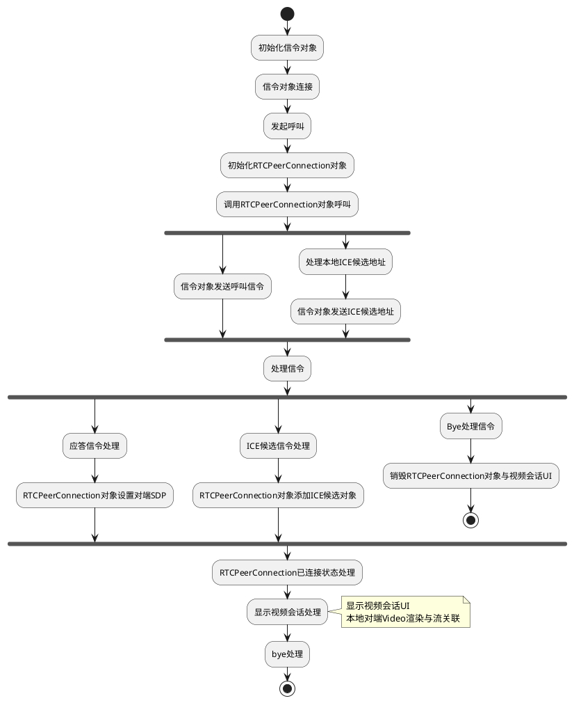
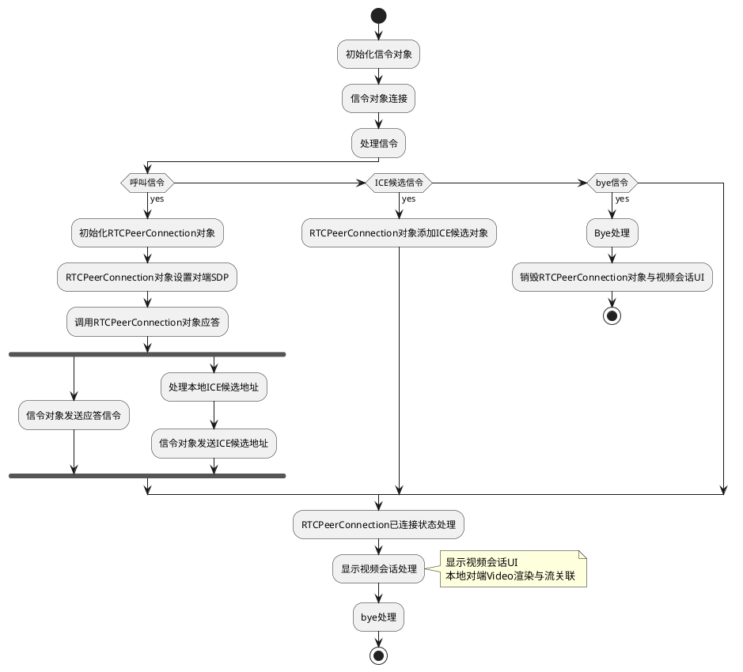
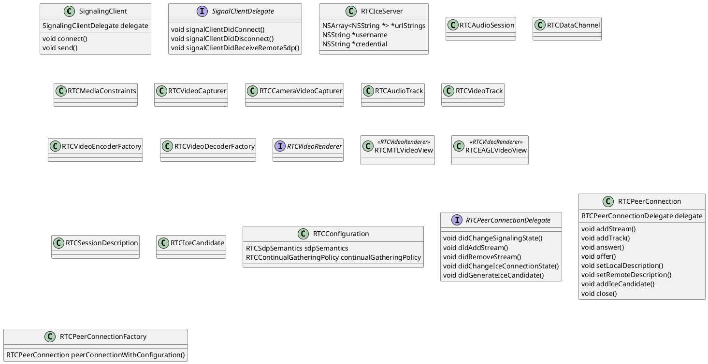

# WebRTC 呼叫活动图

```plantuml
@startuml
start
:初始化信令对象;
:信令对象连接;
:发起呼叫;
:初始化RTCPeerConnection对象;
:调用RTCPeerConnection对象呼叫;
fork
:信令对象发送呼叫信令;
fork again
:处理本地ICE候选地址;
:信令对象发送ICE候选地址;
end fork

:处理信令;
fork
:应答信令处理;
:RTCPeerConnection对象设置对端SDP;
fork again
:ICE候选信令处理;
:RTCPeerConnection对象添加ICE候选对象;
fork again
:Bye处理信令;
:销毁RTCPeerConnection对象与视频会话UI;
stop
end fork
:RTCPeerConnection已连接状态处理;
:显示视频会话处理;
note right
显示视频会话UI
本地对端Video渲染与流关联
end note
:bye处理;
stop

@enduml
```

# WebRTC 应答活动图

```plantuml
@startuml
start
:初始化信令对象;
:信令对象连接;
:处理信令;
if(呼叫信令) then (yes)
:初始化RTCPeerConnection对象;
:RTCPeerConnection对象设置对端SDP;
:调用RTCPeerConnection对象应答;
fork
:信令对象发送应答信令;
fork again
:处理本地ICE候选地址;
:信令对象发送ICE候选地址;
end fork
elseif(ICE候选信令) then (yes)
:RTCPeerConnection对象添加ICE候选对象;
elseif(bye信令) then (yes)
:Bye处理;
:销毁RTCPeerConnection对象与视频会话UI;
stop
endif
:RTCPeerConnection已连接状态处理;
:显示视频会话处理;
note right
显示视频会话UI
本地对端Video渲染与流关联
end note
:bye处理;
stop

@enduml
```

# 调用WebRTC SDK 主要类图

```plantuml
@startuml

class SignalingClient {
    SignalingClientDelegate delegate
    void connect()
    void send()
}

interface SignalClientDelegate {
    void signalClientDidConnect()
    void signalClientDidDisconnect()
    void signalClientDidReceiveRemoteSdp()
}


class RTCIceServer {
    NSArray<NSString *> *urlStrings
    NSString *username
    NSString *credential
}

class RTCAudioSession {

}

class RTCDataChannel {

}

class RTCMediaConstraints {
   
}

class RTCVideoCapturer {

}

class RTCCameraVideoCapturer {

}

class RTCAudioTrack {

}
class RTCVideoTrack {

}

class RTCVideoEncoderFactory {

}

class RTCVideoDecoderFactory {

}


interface RTCVideoRenderer {

}

class RTCMTLVideoView <<RTCVideoRenderer>> {

}

class RTCEAGLVideoView <<RTCVideoRenderer>> {
    
}


class RTCSessionDescription {

}


class RTCIceCandidate {

}


class RTCConfiguration {
    RTCSdpSemantics sdpSemantics
    RTCContinualGatheringPolicy continualGatheringPolicy
}

interface RTCPeerConnectionDelegate {
    void didChangeSignalingState()
    void didAddStream()
    void didRemoveStream()
    void didChangeIceConnectionState()
    void didGenerateIceCandidate()
}

class RTCPeerConnection {
    RTCPeerConnectionDelegate delegate
    void addStream()
    void addTrack()
    void answer()
    void offer()
    void setLocalDescription()
    void setRemoteDescription()
    void addIceCandidate()
    void close()
}

class RTCPeerConnectionFactory {
    RTCPeerConnection peerConnectionWithConfiguration()
}
@enduml
```